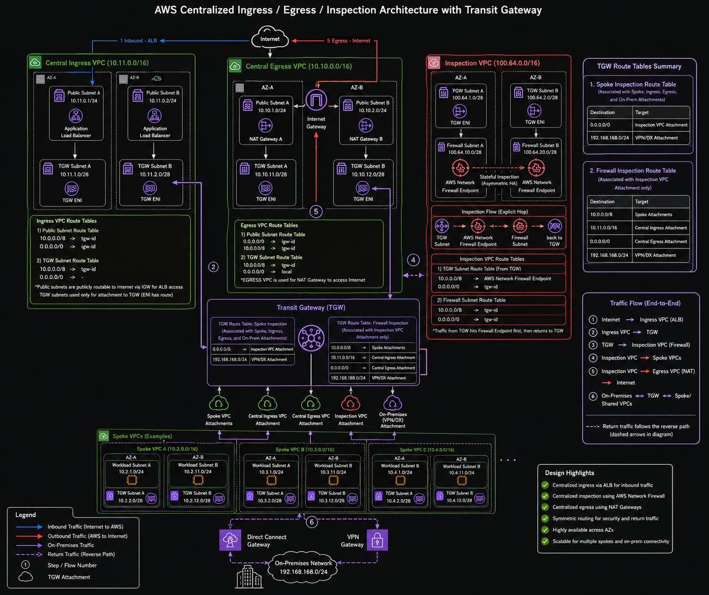

# AWS Transit Gateway Hub and Spoke Architecture

## Overview
This repository contains a Terraform-based implementation of a centralized hub-and-spoke AWS network architecture. The design is modeled on AWS best practices for multi-VPC infrastructure, featuring centralized inbound and outbound traffic inspection utilizing AWS Transit Gateway and AWS Network Firewall.



## Architecture Highlights
- **Transit Gateway (TGW):** Serves as the central routing hub connecting all Virtual Private Clouds (VPCs).
- **Inspection VPC:** Contains AWS Network Firewall for centralized traffic inspection.
- **Central Ingress VPC:** Hosts an Application Load Balancer (ALB) as the internet-facing entry point for inbound application traffic.
- **Central Egress VPC:** Provides NAT Gateways for centralized, secure outbound internet access.
- **Spoke VPCs (A & B):** Isolated workload environments containing EC2 instances, accessible securely via EC2 Instance Connect Endpoints.

## Traffic Routing & Security
All cross-VPC and internet-bound traffic is explicitly routed through the Transit Gateway to enforce centralized security policies.

### Outbound Traffic (Egress Flow)
1. A Spoke EC2 instance initiates an outbound request.
2. The Spoke VPC route table forwards all `0.0.0.0/0` traffic to the Transit Gateway.
3. The Transit Gateway routes the traffic to the Inspection VPC.
4. AWS Network Firewall inspects the traffic against stateful policies.
5. Allowed traffic is returned to the Transit Gateway.
6. The Transit Gateway forwards the traffic to the Egress VPC.
7. The NAT Gateway performs Network Address Translation and sends traffic out via the Internet Gateway.

### Inbound Traffic (Ingress Flow)
1. Internet traffic arrives at the Application Load Balancer in the Central Ingress VPC.
2. The ALB routes traffic to the Transit Gateway.
3. The Transit Gateway forwards the traffic to the Inspection VPC.
4. AWS Network Firewall inspects the inbound payload.
5. Allowed traffic is returned to the Transit Gateway.
6. The Transit Gateway routes the traffic to the destination Spoke VPC workload.

## Secure Instance Access
This architecture eliminates the need for public IP addresses, bastion hosts, or long-lived SSH keys. It utilizes **EC2 Instance Connect Endpoints (EICE)** for secure, private tunneling.

To connect to a spoke instance via the AWS CLI:
```bash
aws ec2-instance-connect ssh --instance-id <instance-id>
```

## Deployment Instructions

### Prerequisites
- Terraform v1.5.0 or newer
- AWS CLI configured with appropriate credentials
- Default Deployment Region: `us-east-2`

### Deployment Steps
Initialize the working directory containing Terraform configuration files:
```bash
terraform init
```

Preview the execution plan:
```bash
terraform plan
```

Deploy the infrastructure:
```bash
terraform apply
```

## Validation & Testing
To validate that the AWS Network Firewall is actively inspecting outbound traffic, the firewall policy is currently configured to pass TCP/UDP traffic and drop ICMP traffic.

From within a Spoke EC2 instance:
- `curl -I -m 5 https://google.com` (Succeeds via TCP)
- `ping google.com` (Fails/Drops via ICMP)

## Future Considerations
- **Hybrid Connectivity:** The Transit Gateway is positioned to accept attachments for AWS Direct Connect and AWS Site-to-Site VPN for on-premises integration.
- **State Management:** For production workloads, migrate local Terraform state to an AWS S3 backend with DynamoDB state locking.
